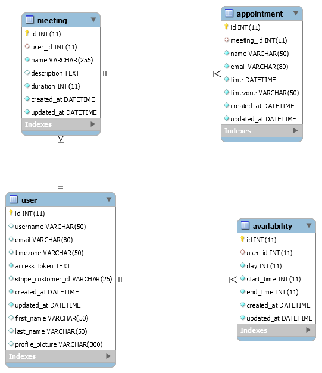

<h1 align="center">
   
  
   
  Database Models
</h1>

<h4 align="center">A minimal Calendly clone built with Node and React.</h4>

  <a href="eer-model">EER Model</a> |
  <a href="#appointment">Appointment</a> |
  <a href="#availability">Availability</a> |
  <a href="#meeting">Meeting</a> |
  <a href="#user">User</a>

## Changes to be made
- models below currently in python/flask syntax; will update to Mongoose/JS syntax 

## EER Model

<b>NOTE: All times must be sent in UTC format, everything returned is ALSO in UTC format.</b>

## Appointment
- id &rarr; Auto increment don't modify
- meeting_id &rarr; Foreign key that connects to a meeting
- name &rarr; Maximum length 50, name of person requesting the appointment
- email &rarr; Email address of the person requesting the appointment
- time &rarr; Datetime value of when they are requesting the appointment
- timezone &rarr; String format of the timezone the person requesting the appointment is in
    - E.g. "America/Toronto", "Europe/Berlin"
- created_at &rarr; Only ever changed ONCE
- updated_at &rarr; Updated every time something changes

## Availability
- id &rarr; Auto increment don't modify
- user_id &rarr; Foreign key that connects to a user
- day &rarr; A integer value (`1` is Monday `7` is Sunday)
    - This means the value must be between 1 and 7 (inclusive)
- start_time &rarr; This is a int value indicating the minutes in the day
    - 9 AM is 540 (60 minutes * 9 hours = 540 minutes)
- end_time &rarr; Same as start_time. API automatically makes sure end_time comes AFTER start_time
- created_at &rarr; Only ever changed ONCE
- updated_at &rarr; Updated every time something changes

## Meeting
- id &rarr; Auto increment don't modify
- user_id &rarr; Foreign key that connects to a user
- name &rarr; A meeting name, a title really. Max 255 characters.
- description &rarr; Meeting description, user can enter whatever they like here.
- duration &rarr; Integer value indicating the total length of meeting in minutes
- created_at &rarr; Only ever changed ONCE
- updated_at &rarr; Updated every time something changes

## User
- id &rarr; Auto increment don't modify
- first_name &rarr; Comes from Google, their first name
- last_name &rarr; Comes from Google, their given name
- username &rarr; This is the unique URL endpoint for the user, and their username
- email &rarr; This should come from Google
- timezone &rarr; Timezone string value
- profile_picture &rarr; Comes from Google, their profile picture
- access_token &rarr; Required, this is pulled from Google
- stripe_customer_id &rarr; Don't worry about this for now, this is for stripe integration later
- created_at &rarr; Only ever changed ONCE
- updated_at &rarr; Updated every time something changes

